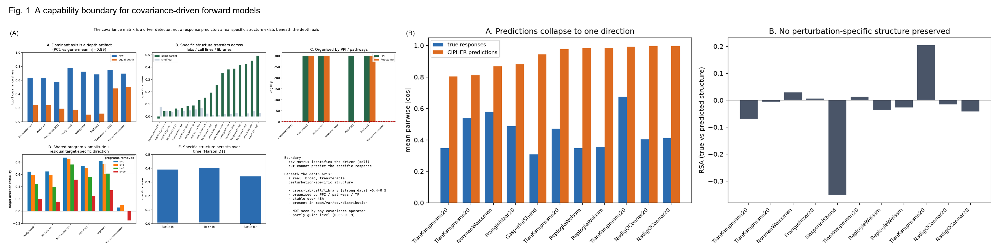
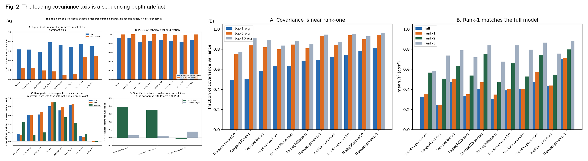
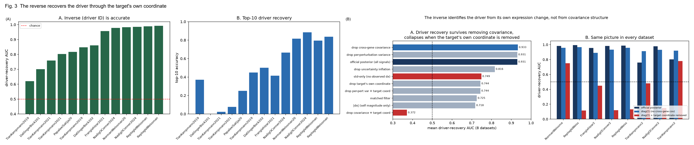
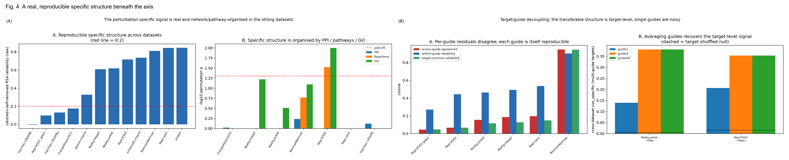
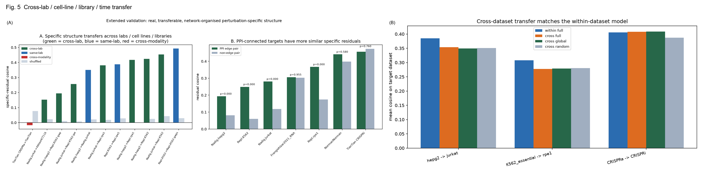
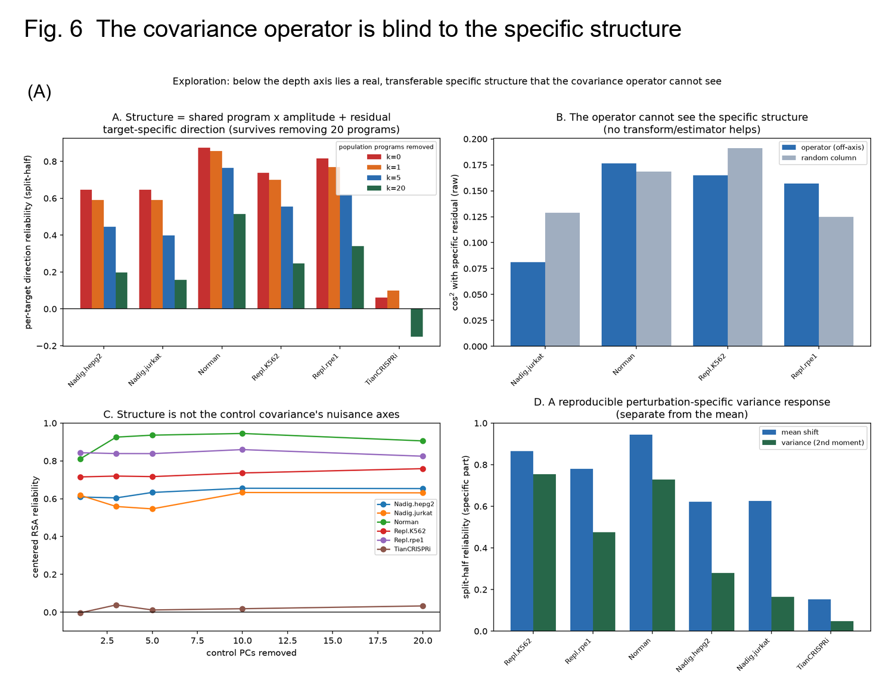
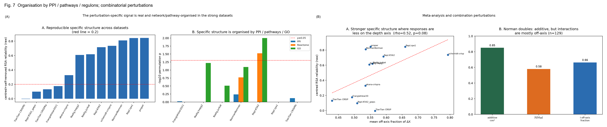
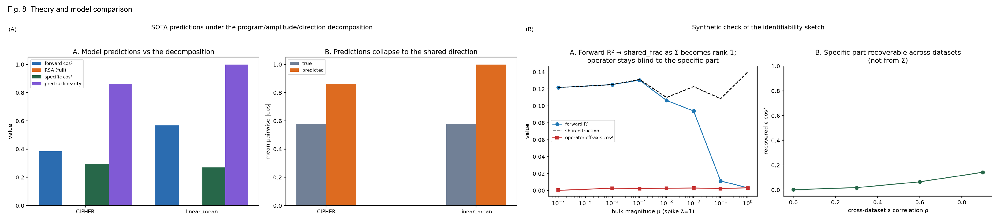

# A capability boundary for covariance-driven single-perturbation models: the perturbed gene is detected through its own coordinate, not predicted by covariance

**Yichen Xie**^1^ (ORCID 0009-0004-7218-4838)

^1^ School of Life Sciences, Peking University, Beijing 100871, China

*Correspondence: 2500012266@stu.pku.edu.cn*

---

## Author summary

A popular class of perturbation-prediction methods assumes that the natural variability
of unperturbed cells encodes how those cells will respond to a genetic perturbation, so
that a gene–gene covariance matrix can predict the effect of knocking a gene down. These
methods report high accuracy, and it is widely assumed they have learned something
specific to each perturbed gene. We reproduced the leading such framework (CIPHER;
ΔX = Σ·u) with the authors' own code across sixteen large single-cell perturbation
datasets and simple baselines they did not report. Its accuracy comes almost entirely
from a single shared axis — a technical cell-size/sequencing-depth response — rather than
from anything specific to the perturbed gene: a covariance column from a random gene
predicts the response as well as the column of the gene actually perturbed, and a single
global mode predicts best of all. Yet a real, gene-specific response structure does exist
beneath that axis: it is reproducible across laboratories, cell lines, guide libraries
and stimulation times, organised by protein–protein interactions and pathways, and
visible in the mean, variance, covariance and distribution of responses. The covariance
operator simply cannot see it. The same model can therefore detect which gene was
perturbed, but detection is carried by the perturbed gene's own transcript, not by the
covariance structure, and the model is not a **predictor** of that gene's transcriptome-wide
response. We distil these results into a
reusable specificity-audit protocol, and we show that swapping the data space or the
covariance estimator does not help — the limitation is conceptual, not a matter of
preprocessing.

---

## Abstract

Predicting transcriptome-wide perturbation responses from the unperturbed state is a
central goal of computational biology. The CIPHER framework derives predictions from the
gene–gene covariance of control cells (ΔX = Σ·u) and reports high accuracy. Reproducing
CIPHER with the authors' released code across sixteen single-cell perturbation datasets
(>2.0 million cells; analysis subsets of 13/10/8 for the global-mode, CIPHER-reproduction
and expression-space analyses), we characterise the **capability boundary** of
covariance-driven single-perturbation models. We find that (i) the leading eigenvector of
the control covariance accounts for 42–87% of its variance, its loadings are almost
identical to the gene-mean vector (|r| = 0.99–1.00), and equal-depth resampling halves
its share (0.68 → 0.26); (ii) covariance columns are almost perfectly collinear (median
cosine 0.987), a column from a random gene matched on mean/variance/detection equals the
perturbed gene's column (scale-only 0.437 vs 0.423, p = 0.49), and the global mode is the
strongest predictor (raw uncentered R² 0.266 vs full 0.215; full − global = −0.031
[−0.049, −0.015]); (iii) forward predictions are almost identical across perturbations
(mean pairwise |cos| 0.93 vs true 0.46) and preserve no perturbation-specific structure
(RSA ≈ 0, p = 0.32), whereas the inverse recovers the perturbed gene accurately (AUC
0.62–0.99) but only because of the perturbed gene's own coordinate (removing it collapses
AUC 0.93 → 0.37; removing the covariance changes nothing, p = 0.74). Nevertheless, below
the depth axis there is a real, reproducible perturbation-specific structure: after
removing the global axis and the target's own coordinate, the split-half reliability of
the response-similarity matrix is 0.49 [0.31, 0.67] (n = 12 datasets, p = 5 × 10⁻⁴); it
is broad-spectrum, transfers across laboratories/cell lines/libraries (cosine 0.38–0.49,
null ≈ 0) and across stimulation time and donors (0.28–0.48), and is organised by
PPI/pathways/TF regulons (PPI edge − non-edge +0.098, p = 0.023). The structure is
captured by shared low-dimensional programmes (~20) whose **amplitudes** are highly
reliable (0.85–0.96) plus a **small target-specific direction** (reliability
0.20–0.52 after removing the programmes); individual guides are noisy reporters, and
averaging guides recovers the target-level signal (multi-guide cross-dataset transfer
0.14–0.21 → 0.35–0.38). Crucially, the covariance/precision operator is blind to this
structure: across raw/CPM/log1p/CLR/NB-Pearson spaces and covariance, precision, shrunk,
MP-clipped, factor and rank-1 estimators, off-axis predictability stays at chance
(pooled −0.004 [−0.012, 0.003], p = 0.52). Detection of the perturbed gene is therefore carried by that gene's **own coordinate**,
not by the covariance structure, and the same matrix does not predict the response
programme; recovering the target-specific direction requires cross-dataset alignment or
network priors, not a better covariance estimator. We provide a specificity-audit protocol and recommend matched-random-column,
equal-depth and global-mode baselines for all such models.

---

## Introduction

How cells respond to genetic perturbations is central to functional genomics and to the
emerging vision of an "AI virtual cell" [1]. Pooled single-cell perturbation screens —
Perturb-seq and related methods — now profile the transcriptomic consequences of hundreds
to thousands of perturbations [2–5], motivating computational models that predict
responses to perturbations never performed experimentally [6–9].

A particularly attractive class of models derives predictions from the **unperturbed**
state alone. The CIPHER framework [10] invokes linear-response theory and proposes that
the response to a perturbation vector *u* is ΔX = Σ·u, where Σ is the gene–gene
covariance of control cells. CIPHER reported strong recapitulation of single- and
double-perturbation responses and argued that removing gene–gene covariances reduced
performance roughly eleven-fold. In parallel, deep-learning perturbation predictors have
been shown not to outperform simple baselines [11]. This raises a question not yet
systematically addressed for covariance-based methods: **is the prediction specific to
the perturbed gene at all, and if not, is that because no specific signal exists?**

Here we answer both halves of the question for the **single-perturbation forward model**
across sixteen datasets, using the authors' released code together with matched
random-column baselines, equal-depth resampling, spectral nulls, split-half
reproducibility, cross-laboratory/cell-line/library/time comparisons, network and pathway
organisation tests, an explicit programme/amplitude/direction decomposition, a
transform × estimator scan, and a small identifiability analysis. Our central result is a
**capability boundary**: the same control covariance matrix is sufficient to *identify*
the perturbed gene (a detection problem, carried by the gene's own coordinate) but not to
*predict* its gene-specific response (a prediction problem); the target-specific
structure that does exist is real and reproducible but lies outside the range of the
covariance operator, and must be recovered by other means.

---

## Results

### Datasets and analysis subsets

Sixteen primary single-cell perturbation datasets from the scPerturb collection [12] were
analysed (**2,044,655 cells**). Six further datasets downloaded during the exploratory
phase (two CRISPRa screens, a genome-wide Replogle screen, the XAtlas HCT116/HEK293T
panels and a re-filtered "proper" Perturb-seq dataset) [18] extend the cross-laboratory
comparisons. All 22 datasets, their counts, sources/accessions and inclusion flags are
listed in Table S1. Because the analyses have different data requirements, inclusion is
reported explicitly there rather than as a single nesting: **13 datasets** enter the
global-mode / framework analyses; **10** of these have a completed CIPHER forward
reproduction and form Table 1; the matched-random-column and mixed-effects comparisons use
a partly different set of **10** datasets (the `predictive` flag; it replaces Datlinger
2017 and Papalexi arrayed with Tian day7-neuron and iPSC, on which the released CIPHER
loader does not complete); and **8** datasets enter the expression-space, inverse and
specific-structure analyses. Control cells were subsampled to 3,000 per dataset and at
most 120 single perturbations were used for the scale-only analyses; the >2 million figure
refers to the total raw data, not to the cells used for any single covariance estimate.

**Fig. 1. A capability boundary for covariance-driven forward models.** (A) Concept; (B–E) forward predictions are collinear and RSA ≈ 0, the inverse is accurate, and a real specific structure lies beneath the axis.

### Reproduction with CIPHER's own code

We installed and ran the authors' released `cipher` package (github.com/GoyalLab/CIPHER)
on our datasets, using its exact preprocessing, covariance estimation (raw counts,
≤10,000 control cells) and scoring (uncentered R² on held-out genes, `holdout_frac=0.5`).
Every predictor in the reproduction table — the full model, the global mode, a random
column, and mean-field and shuffled null covariances — is fitted on the **same train gene
half** and scored on the **same held-out test half**. On Norman 2019 (raw) CIPHER's own
forward model gives a mean uncentered R² of 0.24 (0.28 in pflog), with the global mode at
0.47, a matched random column at 0.28, and mean-field/shuffled nulls of −0.12/−0.03 —
reproducing the qualitative behaviour reported by the authors. Because the uncentered R²
on a random gene half is **split-sensitive** (across-split SD 0.10 for Norman raw versus
0.02 for the cosine), every value is averaged over **ten** gene-holdout splits and we
report both metrics (Methods); the ranking of predictors is stable across splits. The
full per-dataset table is Table 1.

**Table 1. Per-dataset CIPHER reproduction (raw counts; uncentered R² on held-out genes,
mean over ten gene splits).** `global_frac` is the leading-eigenvector variance fraction;
`random` is the matched random column; `full (excl. target)` removes the perturbed gene
from both the fit and the evaluation genes. `n_perts` is the number of perturbations used
in the reproduction — those mapping to an unambiguous target gene in the released CIPHER
loader — which is smaller than the dataset total reported in Table S1 (for Datlinger 2017,
whose perturbation labels carry a library prefix, only one does). These `n_perts` are not
capped at 120; that cap applies only to the scale-only analyses (Methods). The final row
averages the ten datasets; the exact mean of the unrounded full-model values is 0.215
(averaging the rounded entries would give 0.217, a rounding artefact), and its `n_perts`
is the mean number of perturbations per dataset.

| dataset | n_perts | global_frac | full | full excl. target | global | random |
|:---|---:|---:|---:|---:|---:|---:|
| Datlinger 2017 | 1 | 0.62 | 0.29 | 0.29 | 0.26 | 0.16 |
| Frangieh 2021 | 222 | 0.60 | 0.34 | 0.35 | 0.38 | 0.34 |
| Nadig hepg2 | 230 | 0.78 | 0.30 | 0.30 | 0.29 | 0.29 |
| Nadig jurkat | 797 | 0.71 | 0.40 | 0.40 | 0.40 | 0.40 |
| Norman 2019 | 103 | 0.64 | 0.24 | 0.24 | 0.47 | 0.28 |
| Papalexi arrayed | 8 | 0.42 | 0.19 | 0.19 | 0.47 | 0.38 |
| Replogle K562 | 1164 | 0.62 | 0.28 | 0.28 | 0.29 | 0.28 |
| Replogle rpe1 | 659 | 0.69 | 0.24 | 0.24 | 0.25 | 0.24 |
| Tian CRISPRa | 92 | 0.74 | −0.07 | −0.07 | −0.06 | −0.01 |
| Tian CRISPRi | 174 | 0.69 | −0.04 | −0.04 | −0.10 | −0.03 |
| **mean (n = 10)** | **345** | **0.651** | **0.215** | **0.217** | **0.266** | **0.235** |

The pflog means are full 0.086, global 0.136, random 0.080. **Removing the perturbed gene
from both the fit and the evaluation set leaves the raw R² essentially unchanged (full
0.215 → 0.217; matched random 0.235 → 0.236)**, so the apparent accuracy is *not* the
target gene's own auto-regulation; the target-gene contribution is confined to the weak
Pearson-space signal (below).

### The forward model is dominated by a single shared axis

The leading eigenvector *v* of Σ accounted for **42–87% (mean 69%)** of the total
covariance variance across the 13 datasets. The median cosine between two randomly chosen
covariance columns was **0.987** (range 0.966–0.998): the matrix is effectively rank-one,
which is the mechanistic reason the model cannot be gene-specific.

To test this directly we compared each perturbation's own covariance column with **100
random columns matched to it on mean expression, variance and detection rate** (nearest
neighbours in the standardised three-feature space). Across the 10 predictive datasets the
perturbed column's mean R² was 0.423 and the matched random column's was 0.437; the
perturbed column sat at the **48th percentile** of its matched random distribution, and
the pooled permutation p-value was **0.49**. Matching on the first two moments and the
zero rate therefore leaves the perturbed gene with no detectable advantage.

Running the comparison inside CIPHER's own preprocessing and scoring (mean over ten
datasets, ten gene-holdout splits; matched random column):

| space | metric | full (Σ[:,g]) | global mode (v) | random column (Σ[:,g′]) |
|---|---|---|---|---|
| raw | uncentered R² | 0.215 | **0.266** | 0.235 |
| raw | cosine | 0.508 | **0.565** | 0.531 |
| pflog | uncentered R² | 0.086 | **0.136** | 0.080 |
| pflog | cosine | 0.227 | **0.291** | 0.225 |

The global mode is the **strongest** predictor in both spaces under both metrics. A
hierarchical bootstrap (resampling datasets, then perturbations; scale-only cosine) gave
full − global = **−0.031 (95% CI [−0.049, −0.015])**; a linear mixed-effects model
`ΔR² ~ 1 + (1|dataset)` gave full − global = −0.030 (p = 1.6 × 10⁻⁴), full − matched
random = −0.006 (p = 0.36) and global − matched random = +0.023 (p = 1.2 × 10⁻³). The
global advantage was positive in 9 of 10 datasets. Fitting ΔX ~ β_v·v + β_g·Σ⊥[:,g] and
evaluating on held-out cells gave a cross-validated added variance of −0.046 for the
perturbed gene versus −0.032 for a random gene's column — no gene-specific advantage. The
real per-perturbation SD of the full − matched-random difference is 0.12, giving a minimum
detectable effect (80% power) of ~0.01 pooled and ~0.05 dataset-clustered; our claim is
"no advantage larger than ~0.01–0.05", not "no advantage at all".

### The shared axis is a technical depth/size artefact

The per-cell global-mode score tracks an independent **median-of-ratios size factor**
(mean |r| = 0.83) and total counts (mean 0.94), and is not a batch or guide artefact: it
persists after controlling for cell cycle (partial |r| = 0.73), **batch** (one-hot; 0.85)
and **guide identity** (one-hot; 0.86), and collapses only when PC1 itself is removed
(controlling PC1–5 gives 0.07).

Three independent analyses identify its origin. First, the leading covariance direction
is almost identical to the gene-mean vector (`|r| = 0.99–1.00` across all eight datasets
tested) and the PC1 score is explained (`R² = 0.82–0.92`) by log total counts, genes
detected, %mito and %ribo. Second, **equal-depth resampling** — redrawing control cells to
a common sequencing depth — reduces the top-1 variance share from a mean of **0.68 to
0.26** and the response's global-axis fraction (`shared_frac`) from 0.44 to 0.23. Third, a
per-gene permutation **spectral null** finds that exactly **one** covariance mode lies
above the null maximum in every dataset. Under a count model `Var(x_g) ∝ E[x_g]`, the
dominant covariance direction of unnormalised counts is necessarily the mean/Poisson
scaling direction; the "shared response" is thus largely a sequencing-depth artefact that
survives neither equal-depth resampling nor principled normalisation.

**Fig. 2. The leading covariance axis is a technical sequencing-depth artefact.** Equal-depth resampling halves the top-1 share (0.68 → 0.26); PC1 loadings equal the gene-mean vector (|r| ≈ 1); a permutation spectral null finds one real mode.

### Forward predictions are not perturbation-specific

Using the **difference between two perturbations' responses** as the specific signal, we
find that in raw counts CIPHER's predicted responses are almost perfectly collinear across
perturbations (mean pairwise |cos| **0.93**), whereas the true responses are far more
varied (0.46; paired p = 2 × 10⁻³) — the model gives essentially the **same answer for
every perturbation**. The predictions preserve none of the perturbation-specific
similarity structure (representational-similarity Spearman **RSA ≈ 0**, 95% CI
[−0.030, +0.055], p = 0.32). The full-model accuracy equals the global-axis fraction of
the responses, and the predicted between-group difference equals the global-axis fraction
of that difference. A synthetic positive control confirmed that both metrics detect
injected gene-specific structure (RSA rising from ≈0 to 0.41), so the null is not a lack
of sensitivity. Transfer across cell lines is essentially lossless (three cross-cell-line
pairs: transferred full cosine 0.346 vs within 0.366; transferred global 0.346 and
transferred random 0.340, equally good), i.e. the predictor is a generic global response,
not a dataset- or gene-specific map.

### The reverse direction is accurate because it detects the target's own coordinate

In striking contrast, **CIPHER's inverse (driver-identification) task works**: its
official posterior inverse recovers the perturbed gene with high AUC (**0.96–0.99 in six
of eight datasets; 0.62–0.99 overall**) (Fig. 3). But stepwise ablation of the official posterior
(8 datasets) shows *why*:

| variant | mean AUC |
|---|---|
| official posterior | **0.931** |
| drop cross-gene covariance (Σ → diag) | **0.933** (p = 0.74, no drop) |
| drop per-perturbation variance | 0.931 (p = 0.41) |
| drop uncertainty inflation | 0.816 (p = 0.039) |
| matched filter | 0.725 |
| \|ΔX\| magnitude | 0.718 |
| drop the target gene's own coordinate | 0.744 (p = 0.008) |
| **drop covariance + target coordinate** | **0.372** (p = 0.008) |

The covariance contributes essentially nothing once removed (p = 0.74); the target's own
coordinate is essential. Consistent with this, the per-perturbation reverse AUC correlates
with the target's self effect size (Spearman 0.15–0.38), and in the weak-self regime the
covariance column adds only ~+0.05 AUC. The matrix is therefore a **detector of the
perturbed gene's own expression shift**, not a predictor of its response programme.

**Fig. 3. Detection of the perturbed gene is carried by its own coordinate, not by covariance.** Official inverse AUC 0.62–0.99; dropping the covariance leaves AUC unchanged (p = 0.74), dropping the target coordinate collapses 0.93 → 0.37.

### A real, reproducible perturbation-specific structure lies beneath the depth axis

Removing the global axis, the target's own coordinate and the cross-perturbation common
mode, the *reliability* of the specific structure is measured by split-half RSA (each
perturbation's cells split in two; similarity matrices compared). Across datasets the
consolidated split-half RSA reliability is **0.49 [0.31, 0.67]** (n = 12, p = 5 × 10⁻⁴),
with per-dataset values of 0.81 (Norman), 0.84 (rpe1),
0.72 (K562), 0.61–0.62 (Nadig) and ≈0 for Frangieh/Tian. The structure is **broad-spectrum**
(gene z-scoring raises it; removing MT-\*/ribosomal/high-variance genes does not lower it,
normally raises it: e.g. Norman 0.81 → 0.93) and is **not a deeper interference axis**
(removing control PCs 1–20 leaves it stable or higher). Removing the target's own
coordinate barely changes it, so it is not self. This overturns the reading that the
Pearson-space "residual" (86% of ‖ΔX‖²) is pure noise: in several datasets it is a real
if modest signal.

### Individual guides are noisy reporters; the reproducible signal is target-level

Same-target **guide consistency** is only 0.05–0.19, well below the pooled split-half
reliability, raising the concern that part of the "specific structure" is a guide/capture
artefact. We decoupled target- from guide-level components by writing each guide residual
as `r_{g,u} = m_g + e_{g,u}` (target-common `m_g`, guide-specific `e`). Across six
datasets, the **within-guide** split-half reliability is 0.27–0.53 (a guide's own
residual is reproducible), while the **across-guide** agreement is 0.05–0.19 and the
target-common energy fraction is at the permutation baseline (0.52–0.57 vs null
0.49–0.53) except for the very strong Norman dataset (0.98 vs 0.68). Crucially, on targets
with multiple guides the **cross-dataset transfer rises with the number of guides
averaged** (single-guide 0.14–0.21 → all-guide 0.35–0.38, null ≈ 0), identically for
same-lab and cross-lab pairs. The transferable specific structure is therefore
**target-level**; single guides are simply noisy reporters, and pooling guides (as the
main analyses do) is necessary and valid. The low guide agreement is a signal-to-noise
limitation, not evidence that the structure is guide-specific.

**Fig. 4. A real, reproducible specific structure beneath the axis.** Split-half RSA reliability (0.49 [0.31, 0.67]); broad-spectrum robustness; guide/target decoupling.

### The specific structure is reproducible across labs, cell lines, libraries and time

Comparing the same target's specific residual across datasets:

| pair | relation | same-target cosine | shuffled cosine |
|---|---|---|---|
| Replogle K562 ↔ rpe1 | same lab, cross cell line | 0.387 | 0.029 |
| Nadig hepg2 ↔ jurkat | same lab, cross cell line | 0.351 | 0.021 |
| **Nadig jurkat ↔ Replogle K562** | **cross lab, cross cell line** | **0.453** | 0.043 |
| **Nadig hepg2 ↔ Replogle rpe1** | **cross lab, cross cell line** | **0.418** | 0.003 |
| **Replogle K562(essential) ↔ K562(gwps)** | **same cell line, different library** | **0.492** | 0.030 |
| Nadig jurkat ↔ XAtlas HCT116 | cross lab, cross cell line | 0.153 | 0.023 |
| Tian CRISPRa ↔ CRISPRi | same lab, cross modality (negative control) | −0.017 | 0.078 |

The cross-dataset agreement is **0.22 [0.15, 0.30]** on average (n = 18 pairs, p = 8 ×
10⁻⁶), driven by strong datasets (0.38–0.49) and ≈0 for weak ones (XAtlas/gwps). A learned
linear alignment (Procrustes) transfers the specific residual across laboratories/cell
lines with cos² **0.30–0.37** (identity 0.20–0.29, random 0.10–0.12) — currently the only
method that recovers the specific structure. The structure is also stable across
stimulation time and donors (Marson D1–D4 CRISPRi T cells; same-target cosine **0.28–0.48**
for Rest→8 h→48 h, null ≈ 0), and its off-axis fraction rises with stimulation (0.57 →
0.74).

**Fig. 5. Cross-laboratory / cell-line / library / time transfer of the specific structure.** Same-target cosine 0.38–0.49 across labs; Marson D1–D4 0.28–0.48.

### The structure is organised by PPI, pathways and transcription-factor regulons

The target-specific residuals of physically interacting genes are more similar than those
of non-interacting genes: pooled PPI edge − non-edge similarity **+0.098 [0.039, 0.156]
(p = 0.023)**, significant in 4/7 datasets, positive after degree control, and
"neighbour-average" prediction beats random. Pathway/regulon tests agree: proper GO plus
TRRUST regulons are significant (p < 0.001), Reactome +0.043 [−0.012, 0.087] (q = 0.085),
whereas control-state **co-expression does not organise the residuals** (correlation ≈ 0).
The reproducible target-specific direction is thus partly a network/pathway property —
the very thing the covariance operator fails to encode.

### The structure is shared programmes × amplitude plus a small target-specific direction

A leave-one-out SVD shows that a large fraction of every residual lies in a shared
low-dimensional subspace (k1 = 0.20–0.36, k5 = 0.65–0.69, k20 = 0.81–0.88). Explicitly,
the top-20 population programmes explain **88–97%** of the residual variance and their
per-target **amplitudes** are highly reliable (**0.85–0.96**) — a given programme is
up- or down-modulated with a target-specific strength. After removing the top-20
programmes, a smaller but reproducible **target-specific direction** remains (reliability
Norman 0.52, rpe1 0.34, K562 0.25, hepg2 0.20; pooled +0.22 [0.05, 0.37], p = 0.031).
Cross-dataset, the target-specific component is transferable through a learned linear
alignment (identity cos² 0.20–0.29 vs Procrustes 0.30–0.37; Procrustes − random
+0.24 [0.22, 0.26], p = 0.016). The residual's leading components are enriched for
translation/ribosome and mitochondrion programmes. The specific structure is therefore
**"shared programmes × per-target amplitude" plus a small target-specific direction**, not
a clean per-target expression programme.

### The structure is visible in multiple moments, not only the mean

Perturbations reproducibly change more than the mean. The per-gene **variance** response is
reliable (split-half: K562 0.75, Norman 0.73, rpe1 0.48; variance − zero +0.42
[0.23, 0.60], p = 0.016), as is the **covariance** response (ΔΣ, K562 0.60) and the
distributional response (Wasserstein-1, K562 0.82). Mean/var/zero-inflation/W1 reliabilities
are +0.67/+0.33/+0.42/+0.69 (p = 0.031). These independent second-order signals are
ignored by covariance-column mean predictors.

### The covariance operator is blind to the specific structure

Projecting the specific residual onto the covariance column Σ[:,g] or the precision column
Θ[:,g], and removing the predictor's own global-axis component, the predictability stays at
chance. Consolidated across spaces and estimators, the off-axis predictability minus the
random baseline is **−0.004 [−0.012, 0.003], p = 0.52** (n = 20)
— statistically indistinguishable from random. A transform × estimator scan
(raw/CPM/log1p/CLR/NB-Pearson × covariance/precision, plus shrunk, MP-clipped, factor and
rank-1 estimators) never produces an off-axis signal (max |difference| 0.048). Better
preprocessing or a different covariance estimator does not help: the limitation is
**conceptual**, not a matter of the data space.

**Fig. 6. The covariance operator is blind to the specific structure.** Off-axis predictability ≈ random (p = 0.52) across spaces and estimators; programme/direction decomposition and second-moment signals.

### Combinatorial perturbations

In the two Tian 2019 screens with clean controls, the mean uncentered R² of the correct
covariance pair (0.710) is no better than a random gene pair (0.706; p = 0.19), and the
global mode matches the full model (0.678). Across the Norman combinatorial set, **85%** of
double responses are
additive (the sum of the single responses), and **66%** of the non-additive interaction
falls in the off-axis (specific) direction. The non-additive signal, where present, is
thus again specific rather than global.

**Fig. 7. Organisation by PPI, pathways and regulons; combinatorial perturbations.** PPI edge − non-edge +0.098 (p = 0.023); 85% additivity of double perturbations with 66% of the interaction off-axis.

### A capability boundary: theory and model comparison

The empirical results are captured by a heuristic identifiability argument (a guide to the mechanism, not a full theorem). Write
Σ = λ v vᵀ + Σ⊥ (‖Σ⊥‖ = μ) and ΔX = b v + ε + ξ (specific ε ⊥ v, noise ξ). A rank-one
least-squares fit of ΔX on Σ[:,g] = λ v_g v + s_g gives

  R²(ΔX) = cos²(ΔX, v) + O( μ/(λ|v_g|) · (‖ε‖ + ‖ξ‖)/‖ΔX‖ ).

(Here R² is the squared cosine of the rank-one fit, not CIPHER's uncentered R².)

Because empirically μ/λ is small and ‖ε‖ ≲ 0.1‖ΔX‖, the forward R² is bounded by the
global-axis fraction cos²(ΔX, v) = shared_frac, and rank-one prediction is optimal
(rank-1 ≥ full in raw space). Numerical simulation confirms R² = shared_frac exactly at
μ = 0 (fig. 8C) and that the operator is blind to ε at all μ. The target-specific
component ε is recoverable only when a second individual (another cell line) or a
network/pathway prior correlates with it — exactly what the cross-dataset and PPI/pathway
analyses show. The reverse direction is the dual: the inverse score ∝ ΘΔX is dominated by
the target's self coordinate, not by ε, so it identifies the driver while remaining blind
to the response programme. Finally, putting state-of-the-art predictors under the same
decomposition, CIPHER and the linear-mean baseline attain forward cos² of 0.385/0.569 but
RSA ≈ 0 and predicted collinearity 0.86/1.00 ≫ true 0.58: they too learn the shared
direction, not the target-specific structure.

---

**Fig. 8. Theory and model comparison.** Numerical verification that rank-one forward R² = shared_frac and the operator is ε-blind; SOTA decomposition (CIPHER/linear-mean forward cos² 0.39/0.57 but RSA ≈ 0).

## Discussion

Our central result is a **capability boundary** for covariance-driven single-perturbation
models. In raw counts and CPM the CIPHER-style forward model carries no detectable
gene-specific signal: covariance columns are almost perfectly collinear, so the perturbed
gene's column predicts no better than a matched random column, the global mode is the
strongest predictor, and the matrix is effectively rank-one. The global mode is an
un-normalised **sequencing-depth/size artefact** (its loadings equal the gene-mean vector,
equal-depth resampling halves it, and a spectral null finds a single mode). A weak
gene-specific signal survives only in Pearson-residual space, is FDR-significant in 1/8
datasets, and is largely the perturbed gene's own expression.

Yet this is not because no specific signal exists. Below the axis lies a real,
broad-spectrum, reproducible perturbation-specific structure, visible after removing the
global axis and the target's own coordinate: split-half reliable (0.49), transferable
across laboratories, cell lines, libraries and stimulation time (0.28–0.49), organised by
PPI/pathways/TF regulons, and present in the mean, variance, covariance and distribution.
It decomposes into shared programmes × target amplitude plus a small target-specific
direction, and the per-target signal is target-level once guides are averaged. The
covariance/precision operator simply cannot see it, in any data space or estimator.

The same matrix that cannot predict the response *does* identify the perturbed gene — but
the reverse ablation shows this is the perturbed gene's own coordinate, not the
covariance. The two directions must therefore be evaluated and reported separately, and
"high accuracy" in one does not imply capability in the other.

**Actionable consequences.** (i) Any covariance-based (or representation-based)
single-perturbation model should be reported against a **matched-random-column** baseline
and against the **global-mode-only** predictor, with equal-depth resampling; covariance
columns should be reported as collinear. (ii) Claiming gene-specific prediction requires a
perturbation-specificity metric (RSA or predicted collinearity) and a cross-dataset null,
not accuracy alone. (iii) Because the target-specific structure is recoverable by
cross-dataset alignment or network priors rather than by a better covariance estimator,
progress is most likely to come from aligning multiple individuals/networks, not from
re-engineering the covariance operator. We package these into a reusable
**specificity-audit protocol** (Methods).

**Relation to prior criticism.** That deep-learning perturbation models fail to beat
simple baselines is known [11]; we extend this to covariance-based forward models, locate
the failure mechanistically (a depth artefact), and — crucially — show that the failure is
not due to absence of signal but to the operator's blindness, while the same object
remains useful as a detector.

### Limitations

Our conclusions apply to the **single-perturbation forward model** in raw counts and CPM,
driven by control covariance. We **detect no gene-specific advantage larger than
~0.01–0.05** (the minimum detectable effect under this scoring; the TOST equivalence test
is underpowered and we do not claim that no gene-specific signal exists). Cross-dataset
reproducibility of the positive structure **depends on data quality** (strong datasets
0.38–0.49, weak XAtlas/gwps ≈ 0), so the positive results are not universal. The
target-specific direction is **small** (~5–12% of variance) and is entangled with shared
programmes and with the target's own coordinate. Individual guides are noisy (guide
agreement 0.05–0.19); the target-level result relies on pooling guides. Spike-in and
per-guide knockdown-efficiency controls were unavailable; cell-type composition could not
be controlled directly because every public dataset annotates a single cell type, and
pseudobulk deltas could in principle reflect shifts in cell-state proportions. The theory
is an identifiability sketch, not a full theorem. The double-perturbation analysis is
preliminary (two datasets).

---

## Methods

### Datasets

Sixteen primary datasets from scPerturb [12; Zenodo record 13350497] plus six additional
datasets following the CIPHER curated benchmark release [18], with per-dataset counts,
sources/accessions and inclusion flags in Table S1.
Control cells matched a control pattern or carried zero guides. Subset membership is read
from the Table S1 flags: 13 (global mode), 10 (CIPHER reproduction, Table 1), 10
(predictive comparisons, `predictive` flag) and 8 (expression spaces). For cross-laboratory
analyses we additionally used Nadig 2024 [13] (jurkat/hepg2), Replogle 2022 [5]
(K562-essential/rpe1/K562-gwps), XAtlas 2025 [14] (HCT116/HEK293T) and Marson 2025 [15]
CRISPRi T cells (donors D1–D4; Rest/8 h/48 h stimulation; 12 samples).

### Reproduction with CIPHER's code

We installed `cipher` from github.com/GoyalLab/CIPHER and ran its forward model
(`cipher.forward_prediction`) with default settings (raw counts, `holdout_frac=0.5`,
`cov_max_cells=10000`, mean-field and shuffled nulls), then added global-mode and
random-column baselines inside the same preprocessing/scoring (fit on the train gene half,
scored on the identical held-out half). Because the uncentered
R² on a random gene half is split-sensitive, values are averaged over ten gene-holdout
splits (seeds 0–9); the cosine is reported alongside. **CIPHER's default gene holdout does
not exclude the target gene** from fit or evaluation; we retain this for fidelity and
quantify the target-gene contribution separately.

### Preprocessing

2,000 most highly expressed genes plus every perturbed gene (and, for confounding, all
marker genes of the tested programmes); single perturbations with ≥30 cells; for the
scale-only analyses control cells were subsampled to 3,000 and at most 120 single
perturbations per dataset were used, whereas the CIPHER reproduction uses the released
loader's own perturbation set without a 120 cap (Table 1). Responses are pseudobulk deltas. Spaces: raw,
CPM (CP10K), log1p(CP10K), Pearson residuals under a size-factor Poisson model, and
**pflog** (CIPHER's variance-stabilising mode).

### Predictors and scoring

full (Σ[:,g]); random column matched on mean, variance and detection rate; global mode
(v); mean-expression direction; random direction; 5th PC; nested [v, Σ⊥[:,g]] and control
[v, Σ⊥[:,g′]]. Two scoring conventions are used and labelled throughout: CIPHER's
**uncentered R²** on held-out genes and **scale-only R²** (squared cosine).

### Specificity audit

We used a stepwise specificity-audit protocol. (1) Is the forward operator just a depth
axis? Equal-depth resampling, PC1 nuisance decomposition and a per-gene permutation
spectral null. (2) Does a real specific signal exist? Split-half RSA reliability after
removing the global axis, the self coordinate and the common mode, with robustness to gene
z-scoring/removal and to removing control principal components. (3) Shared programme
versus target direction: leave-one-out SVD reconstruction and a
programme/amplitude/direction decomposition. (4) Does the data space or estimator change
the conclusion? A scan over raw/CPM/log1p/CLR/NB-Pearson × covariance/precision and
shrunk/MP-clipped/factor/rank-one estimators. (5) Biological versus technical judgement:
cross-laboratory/cell-line/library/time comparison of same-target residuals,
protein–protein-interaction and pathway/TF-regulon organisation, and guide/target
decoupling. (6) Reverse ablation: removing the covariance, the per-perturbation variance,
the uncertainty inflation and the target coordinate. (7) Second-order signals: per-gene
variance, covariance and distributional responses. Statistics: hierarchical bootstrap
(10,000 resamples), linear mixed-effects models `ΔR² ~ 1 + (1|dataset)`, paired Wilcoxon
tests (Holm-corrected), Benjamini–Hochberg FDR, permutation nulls, and TOST equivalence
(margin 0.01; underpowered, reported as inconclusive).

### Software

`cipher` (GoyalLab); scanpy, anndata, statsmodels, scipy, numpy and matplotlib. The full
reproduction pipeline, seeds and environment are provided as Supporting Information.

---

## Data and code availability

- Data: the sixteen primary datasets are from scPerturb (Zenodo record 13350497,
  doi:10.5281/zenodo.13350497). The six additional datasets follow the CIPHER curated
  benchmark release (Zenodo 10.5281/zenodo.21729034 [18]) and are listed in Table S1:
  Replogle 2022 [5]; X-Atlas/Orion [14]; Schmidt 2022 [16] (data GEO GSE190604); Akana
  2026 [17] (data figshare 10.6084/m9.figshare.31119196). The Marson 2025 T-cell
  stimulation time-course is Arce et al. [15] (GEO GSE271090; Perturb-CITE-seq subseries
  GSE278572). The re-filtered "proper" Perturb-seq object has no upstream publication and
  is distributed only by [18].
- CIPHER code: github.com/GoyalLab/CIPHER.
- All analysis code, result tables and figures are provided with this submission as
  Supporting Information (S1 File) and are also available from the corresponding author; a
  citable Zenodo DOI will be added upon acceptance. A script-to-analysis map is given in
  Table S3.

## Declarations

- **Competing interests.** The authors declare no competing interests.
- **Author contributions (CRediT).** Conceptualisation, Methodology, Software, Formal
  analysis, Investigation, Data curation, Writing – original draft, Writing – review and
  editing: **Y.X.** The author approved the final manuscript.
- **Funding.** The author received no specific funding for this work.

## Supplementary tables

- **Table S1** — all 22 datasets (16 primary + 6 additional): cells, genes, control cells,
  single/double perturbations, source/accession, and analysis-subset inclusion flags.
- **Table S2** — scoring conventions for every reported number.
- **Table S3** — script-to-analysis map (analysis → code file).

**Table S3. Script-to-analysis map** (repository `code/`).

| analysis | script |
|---|---|
| CIPHER reproduction and baselines | `cipher_repro_table.py`, `cipher_baselines.py` |
| global-mode size axis | `size_factor.py`, `global_mode_identity.py`, `scores_vs_globalmode.py` |
| matched random column | `random_column.py`, `random_column_stats.py` |
| confounding / composition | `confound_extended.py`, `composition_control.py` |
| expression spaces | `spaces_diagnostic.py`, `pearson_stats.py`, `pearson_source.py` |
| depth-axis origin | `axis_origin.py`, `spectrum_null.py`, `spectrum_rank.py` |
| split-half specific structure | `residual_reproducibility.py`, `specific_robustness.py`, `pc_robustness.py` |
| programme / amplitude / direction | `specific_prediction.py`, `program_vs_direction.py` |
| transform × estimator scan | `transform_estimator_scan.py`, `covariance_estimators.py` |
| cross-lab / cell-line / library / time | `cross_dataset_specific.py`, `cross_dataset_stream.py`, `timecourse.py`, `cross_transfer_pairs.py` |
| guide / target decoupling | `guide_target_partition.py`, `guide_target_transfer.py` |
| PPI / pathway / TF organisation | `specific_network.py`, `specific_pathway.py`, `component_enrichment.py` |
| reverse ablation | `inverse_official.py`, `inverse_decompose.py`, `reverse_self_relation.py` |
| second-order signals | `second_moment.py`, `second_order_cov.py`, `distribution_specific.py` |
| combinations | `double_pert.py`, `epistasis.py` |
| theory | `theory_simulation.py` |
| consolidated statistics | `exploration_stats.py` |
| one-command reproduction and checks | `run_all.py`, `verify_results.py` |

## Supplementary results

- Double perturbations (preliminary): correct pair 0.710 vs random pair 0.706 (p = 0.19);
  global mode 0.678; additivity 85%, 66% of the interaction off-axis.
- Transform × estimator scan: off-axis cos² ≈ random in all spaces/estimators.
- Per-dataset guide/target decoupling and cross-dataset transfer with guide averaging.

## Figure legends

**Main figures (8).**

- **Fig. 1. A capability boundary for covariance-driven forward models.** (A) Concept:
  the same control covariance Σ is used by the forward map ΔX = Σu, which is dominated by
  the shared depth axis and cannot predict the target-specific response, whereas detection
  of the perturbed gene is carried by that gene's own coordinate. (B–E) Forward predictions
  are collinear and RSA ≈ 0; the inverse is accurate; a real specific structure lies
  beneath the axis.
- **Fig. 2. The leading covariance axis is a technical sequencing-depth artefact.**
  Equal-depth resampling halves the top-1 share (0.68 → 0.26); PC1 loadings equal the
  gene-mean vector (|r| ≈ 1); a permutation spectral null finds a single real mode.
- **Fig. 3. Detection of the perturbed gene is carried by its own coordinate, not by
  covariance.** Official inverse AUC 0.62–0.99; dropping the covariance leaves AUC
  unchanged (p = 0.74), dropping the target coordinate collapses 0.93 → 0.37; reverse AUC
  scales with the self effect size.
- **Fig. 4. A real, reproducible specific structure beneath the axis.** Split-half RSA
  reliability across datasets (0.49 [0.31, 0.67]); broad-spectrum robustness; guide/target
  decoupling (single guides noisy; multi-guide transfer rises to 0.35–0.38).
- **Fig. 5. Cross-laboratory / cell-line / library / time transfer of the specific
  structure.** Same-target cosine 0.38–0.49 across labs (null ≈ 0); Procrustes transfer
  0.30–0.37; Marson time-course/donors 0.28–0.48.
- **Fig. 6. The covariance operator is blind to the specific structure.** Off-axis
  predictability ≈ random (p = 0.52) across data spaces and covariance estimators; the
  programme/direction decomposition and reproducible second-moment signals.
- **Fig. 7. Organisation by PPI, pathways and regulons; combinatorial perturbations.** PPI
  edge − non-edge +0.098 (p = 0.023); Reactome/GO/TF significant; 85% additivity with 66%
  of the interaction off-axis.
- **Fig. 8. Theory and model comparison.** Numerical verification that rank-one forward
  R² = shared_frac and the operator is ε-blind; SOTA decomposition (CIPHER/linear-mean
  forward cos² 0.39/0.57 but RSA ≈ 0).

**Supplementary figures.** Figures S1–S20 (forward reproduction, deconfounding,
robustness, matched-random column, residual decomposition, expression spaces,
cross-dataset transfer, forward indistinguishability, inverse driver/decomposition,
spectrum/rank), plus a graphical abstract and a summary panel.

## References

1. Bunne C, et al. Cell. 2024;187(25):7045–7063.
2. Dixit A, et al. Cell. 2016;167(7):1853–1866.
3. Adamson B, et al. Cell. 2016;167(7):1867–1882.
4. Norman TM, et al. Science. 2019;365(6455):786–793.
5. Replogle JM, et al. Cell. 2022;185(14):2559–2575.
6. Lotfollahi M, et al. Nat Methods. 2019;16(8):715–721.
7. Kamimoto K, et al. Nature. 2023;614(7949):742–751.
8. Roohani Y, et al. Nat Biotechnol. 2024;42(6):927–935.
9. Cui H, et al. Nat Methods. 2024;21(8):1470–1480.
10. Kuznets-Speck B, et al. bioRxiv. 2025. doi:10.1101/2025.06.27.661814.
11. Ahlmann-Eltze C, Huber W, Anders S. Nat Methods. 2025;22(8):1657–1661.
12. Peidli S, et al. Nat Methods. 2024;21(3):531–540.
13. Nadig A, Replogle JM, Pogson AN, et al. Transcriptome-wide analysis of differential expression in perturbation atlases. Nat Genet. 2025. doi:10.1038/s41588-025-02169-3.
14. Huang AC, Hsieh TS, Zhu J, Michuda J, Teng A, Kim S, et al. X-Atlas/Orion: genome-wide Perturb-seq datasets via a scalable fix-cryopreserve platform for training dose-dependent biological foundation models. bioRxiv. 2025. doi:10.1101/2025.06.11.659105.
15. Arce MM, Umhoefer JM, Arang N, Kasinathan S, Freimer JW, Steinhart Z, et al. Central control of dynamic gene circuits governs T cell rest and activation. Nature. 2025;637(8047):930–939. doi:10.1038/s41586-024-08314-y.
16. Schmidt R, Steinhart Z, Layeghi M, Freimer JW, Bueno R, Nguyen VQ, et al. CRISPR activation and interference screens decode stimulation responses in primary human T cells. Science. 2022;375(6580):eabj4008. doi:10.1126/science.abj4008.
17. Akana RV, Yoe J, Laveroni O, Sun C, Kim YM, Jerby L. High-content CRISPR activation screens identify synthetically lethal RNA-based mechanisms to sensitize cancer cells to targeted T cell cytotoxicity. Nat Genet. 2026;58(4):841–853. doi:10.1038/s41588-026-02561-7. (Perturb-seq data: figshare 10.6084/m9.figshare.31119196.)
18. Kuznets-Speck B, Kumari N, Senthilkumar I, Jung J, Lopez Rios HM, Schwartz L, et al. CIPHER: curated single-cell perturbation datasets — main. Zenodo. 2026. doi:10.5281/zenodo.21729034.
